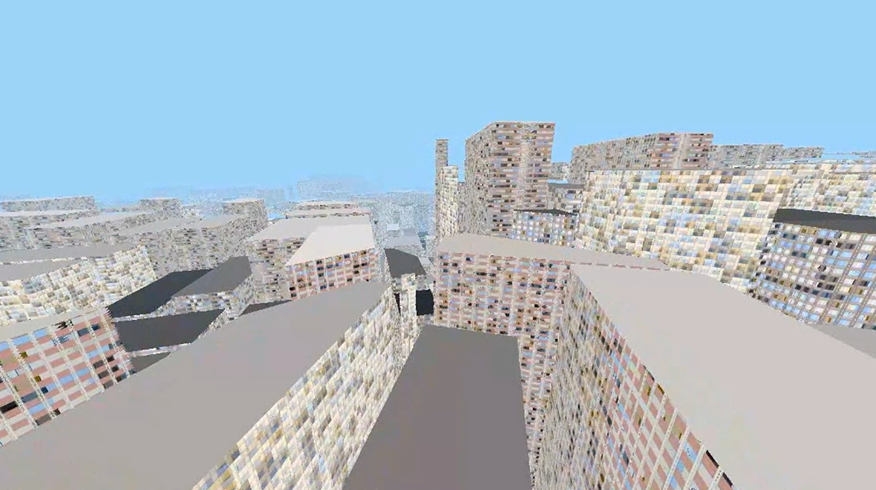

By Julian Heuser (jeh8035) & Audrey Fuller (alf9310@rit.edu)

Click for video!

## Moving to Raymarching

Initially the city generation looked like this:

 

It was done using GPU instanced cubes placed CPU-side with a basic chunking system. This worked fine, but we wanted to challenge ourselves to have this take advantage of the GPU as much as possible. We eventually came to the conclusion that the best way to accomplish this was to move to a completely raymarched scene, rather than use polygons.

The only inputs given by the CPU are the camera position and rotation, and the screen UV. Everything else is calculated entirely by the GPU through a single shader.

There are two components to this that each of use focused on for this project: **The city layout**, and the **texturing of individual buildings**.

## City Layout

 

The city layout code uses two different random noise types
- **Voronoi Noise Cells**: Main city blocks 
- **Tile Splitting**: Inner roads, uses a simple hashing function

 

Each building tile within a block is assigned a height based on its coordinates (unique building and voronoi cell ids). 

 

Each time the city generation function is called by the raymarching loop, it calculates the distance from the current 3D point to the nearest geometry (road, building or sidewalk). This determine how far the ray will step in it's next itteration. 

 

If the distance becomes small enough, a hit is recorded and the type of geometry is used to determine the material!

## Building Material

For individual buildings, a shader technique known as “interior mapping” was used, which can create the effect of a room with depth on a flat surface. It works by finding the intersection of the line between the camera and the pixel in world space, and the planes of the ceiling, floor, and walls.

 

Transferring this to the raymarching shader was easy, as we can easily get the world space coordinates of the final ray destination.

 

Below is with added walls and textures:

 

After this, we can give each room a random value by rounding the world space position, and use it to randomize each room’s textures. To simplify things for the GPU, the room textures are packed into a 2D texture array, with variations stored horizontally:

 

To set the randomized texture, we offset the horizontal UV based on the random hash.

 

For even more variety, there’s an added outer building texture that’s also randomized. However, this would look odd if it was different per window. So we pass in the building ID calculated earlier, and use that as the random value, giving us building variety.

Lasty, a random tint is added to the room, giving the effect of different lights being turned on and off.

## Future Work

The main area for future work is to correct the warping caused by the distance field being slightly inaccurate. To correct for this, we decreased the ray travel distance and increased the iteration count, but this comes at the cost of performance.

Other areas for expansion include:
- More realistic city height mapping
- Using more city generation info for texturing
  - Use the direction of the building to determine the direction of rooms
  - Changing building textures based on "district"
- Ground and building roof textures
- Lighting
- Geometry other than buildings (cars, parks, rivers, ect.)

## Resources

Sites and tools that helped us with this project!
- [**Textures**](https://ambientcg.com/)
- [**More Textures**](https://github.com/Gaxil/Unity-InteriorMapping)
- [**Interior Mapping in Godot**](https://www.youtube.com/watch?v=9Jy3cXwR7Ws)
- [**City Grid Layout Inspiration**](https://actiondawg.itch.io/lust-city-pdf)
- [**Custom Voronoi Noise**](https://godotshaders.com/shader/voronoi-%e7%bb%86%e8%83%9e%e8%be%b9%e7%95%8c%e8%b7%9d%e7%a6%bb/)

